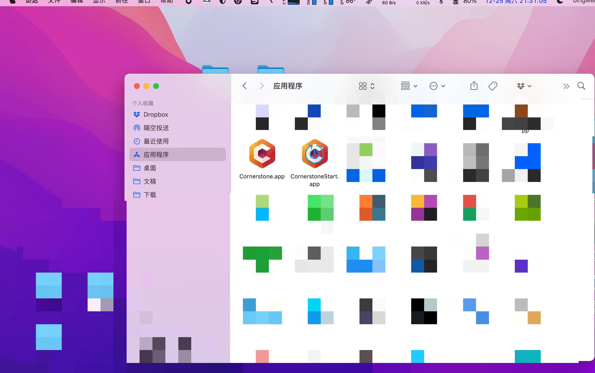

# Cornerstone-Hook

A dynamic library for Cornerstone macOS.

## Screenshot

### Overview

## Quick Start

- `sudo ./install.sh` Install or Upgrade CornerstoneStart.app
- `sudo ./uninstall.sh` Uninstall CornerstoneStart.app

## Dependency

- [JRSwizzle](https://github.com/rentzsch/jrswizzle)

## License

The [Apache License 2.0](LICENSE).
